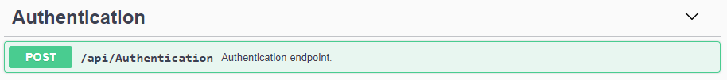
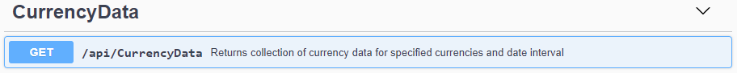

# CurrencyData

Some recruitment task solution.

## Prerequisities

* Visual Studio 2019
* SQL Server 2019

## Getting Started

1. Clone repository. Open solution file in Visual Studio.
2. Run commands - install dotnet-sql-cache package:
```bash
dotnet tool install --global dotnet-sql-cache
```
Create sql cache database:
```bash
dotnet sql-cache create "Data Source=(local);Initial Catalog=<your catalog name>;Integrated Security=True;" dbo <your cache dbo name>
```
3. Change values in _appsettings.json_ to match: your SQL connection string, table name, your local port number (for JWT issuer and audience).
```json
  "Jwt": {
    "SecretKey": "ExampleSecretKeyForJWT",
    "Issuer": "https://localhost:<port>",
    "Audience": "https://localhost:<port>"
  },
  "DistCache": {
    "ConnectionString": "Data Source=(local);Integrated Security=True;",
    "TableName": <your cache dbo name>,
    "SlidingExpirationTimeDays": "3"
  },
```
4. Build and run solution.

## Built With

* .NET 5
* SQL Server 2019
* Swagger
* Automapper
* Log4net
* JWT

## API

API Documentation was created using the [Swagger](https://aspnetcore.readthedocs.io/en/stable/tutorials/web-api-help-pages-using-swagger.html). It is available at url: _localhost/api/index.html_

### Authentication



For testing purposes application uses mock user repository which stores only one user:

```
username: admin
password: 12345
```

**Endpoint:**
```
localhost/api/authentication
```

Request body:

```json
{
  "username": "admin",
  "password": "12345"
}
```

Response body:
```json
{
  "result": true,
  "user": {
    "username": "string",
    "password": "string"
  },
  "token": "string"
}
```

### Currency Data



**Endpoint:**
```
localhost/api/currencydata?currencyCodes[CODE1]=CODE2&startDate={yyyy-MM-dd}&endDate={yyyy-MM-dd}
```

Response body:
```json
{
    "fromCurrency": "PLN",
    "toCurrency": "EUR",
    "startDate": "2010-08-10T00:00:00",
    "endDate": "2020-09-11T00:00:00",
    "exchangeRates": [
        {
            "date": "2010-08-10T00:00:00",
            "rate": 3.9841
        },
        {
            "date": "2010-08-11T00:00:00",
            "rate": 4.0055
        }
        ...
    ]
}
```

## Implementation Details

### Key Generation

API uses JWT for generating Bearer token. The token is then used for authentication in second controller which returns currency data.

### Caching

#### In-Memory Cache

Application uses _Microsoft.Extensions.Caching.Memory_ for in memory caching API responses.

#### Distributed Cache

Application uses SQL Server as distributed cache for storing responses from external API - [EECB SDMX 2.1 RESTful web service](https://sdw-wsrest.ecb.europa.eu/help/).
SQL Caching table was created with [sql-cache tool](https://www.nuget.org/packages/dotnet-sql-cache).

Db Scheme:
| Column name        | Data type           | Allow nulls  |
| ------------- |:-------------:| -----:|
| Id      | nvarchar(900) | No |
| Value      | verbinary(MAX)      |   No |
| ExpiresAtTime | datetimeoffset(7)      |    No |
| SlidingExpirationInSeconds | bigint      |    Yes |
| AbsoluteExpiration | datetimeoffset(7)      |    Yes |

### Logging

Logging  was implemented using the [log4net](https://logging.apache.org/log4net/) library. Log data is saved to the _main.log_ file (_.\CurrencyData.Api\bin\Debug\netcoreapp5\main.log_)

## Testing

Response Times:
* Non-cached: ~627 ms
* SQL cache: ~28 ms
* In-memory cache: ~12 ms

## Author

* **Jakub Wajs** - [github](https://github.com/kubawajs)
